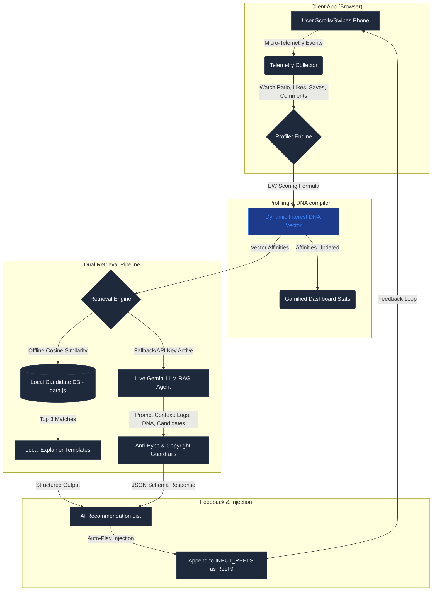

# ReelFocus AI: Agentic Reels Recommendation Engine

An enterprise-grade, client-side web application designed to combat addictive doom-scrolling traps in student feeds. Built for the **"THE ALGORITHM KNOWS YOU TOO WELL"** hackathon challenge, ReelFocus AI intercepts real-time short-form scrolling interactions, compiles a multidimensional interest profile, and auto-injects high-value, educational technology content directly into the user's feed.

---

## 📌 The Problem Statement
Modern short-form content platforms (like TikTok, Instagram Reels, and YouTube Shorts) utilize engagement algorithms optimized to maximize screen time, often trapping students in loops of low-value entertainment, gaming clips, and clickbait. 

### The Dopamine Trap
1. **Shallow Engagement Hooking**: A student scrolling past a basic Java compilation joke is instantly categorized by legacy systems under "Java" and spammed with repetitive, low-value syntax templates, rather than deeper computer science concepts.
2. **Hype & Misinformation**: Buzzword-heavy marketing clips ("Earn $10k/week using ChatGPT prompts") dominate feeds, diverting attention from robust educational fundamentals (DSA, System Design, Cloud Architecture).
3. **Passive Consumption**: Passive watching (dwell time) is rewarded over active learning intents (saving, sharing, commenting, loops).

---

## 💡 The ReelFocus AI Solution
ReelFocus AI flips the script on short-form scrolling by acting as a client-side **intercepting recommendation agent**:
1. **Micro-Telemetry Ingestion**: Monitors specific, high-fidelity interaction telemetry (Watch Duration Ratio, Explicit Likes, Rewatches/Loops, Saves, Shares, and semantic Comment parsing).
2. **Dynamic "Interest DNA" Vector**: Computes and updates interest categories dynamically using mathematical weighting and early-skip penalties.
3. **Dual-Channel Retrieval Pipeline**:
   - **Local Cosine Similarity Match (Offline-First)**: Ranks a static local library of 16 high-value engineering resources in $<1\text{ms}$.
   - **Live LLM Reasoning Agent (Gemini Powered)**: Leverages Gemini 1.5 Flash to write custom reasoning arguments, check candidate difficulties, and filter marketing hype.
4. **Auto-Play Injector**: Seamlessly appends the highest-rated educational video to the end of the feed, allowing the student to swipe directly into a learning path without friction.

---

## 🛠️ The Algorithmic Scoring Formula
To replicate industry-standard recommendation models (like TikTok's Monolith framework), we calculate an **Engagement Weight (EW)** for every reel interaction:

$$EW = \text{WatchRatio} \times \left(1.0 + 0.2 \cdot \text{Liked} + 0.4 \cdot \text{Saved} + 0.5 \cdot \text{Shared} + 0.3 \cdot \text{Commented}\right) \times \left(1.0 + 0.5 \cdot (\text{Loops} - 1)\right)$$

*   **The 3-Second Hook Rule**: If the `WatchRatio` is under $15\%$ (representing an early skip), the video receives a negative penalty ($-0.4$), dampening associated interest categories in the DNA profile.
*   **Active Signal Boosting**: High-intent gestures like **Saves (+0.4)** and **Shares (+0.5)** are heavily weighted over simple **Likes (+0.2)**.
*   **Loop Multiplier**: Each loop (rewatch) multiplies the engagement weight linearly to capture deep focus.
*   **Semantic Booster**: Comment texts containing educational terms (`learn`, `how to`, `study`, `tutorial`) boost the coefficient by an additional `+0.2`.
*   **Anti-Hype Filter**: Skipping clickbait vlogs (like the AI Hype seed video) registers an active block, incrementing the **Hype Filtered** dashboard metric.

---

## 📐 System Architecture

The following diagram illustrates the lifecycle of a scrolling session and how the local vector math integrates with the live Gemini LLM to inject recommendations:



---

## 🔄 Dynamic Workflow Lifecycle

```
[Scroll Action] ➔ [Telemetry Collected] ➔ [Interest DNA Re-indexed] ➔ [Retrieval Match] ➔ [Agent Guardrails] ➔ [Auto-Play Injection]
```

### Stage 1: telemetry Ingestion
Every swipe, progress bar drag, sound toggle, loop, bookmark, comment, or share on the phone simulator registers immediate events.

### Stage 2: Profiling
The Event Profiler executes the mathematical scoring formula. If you watch CS50 introduction and Neetcode interview jokes while skipping Java memes, the model minimizes syntax-level weights and boosts high-level Computer Science and DSA vectors.

### Stage 3: Retrieval & Cosine Matching
The computed Interest DNA vector is mapped against 16 curated candidate templates. A dot product is run between candidate relevance vectors and user preferences:
- If a high local match score ($> 8.0$) is found, the **Local VSM Engine** matches the candidate instantly.
- If no local matches meet the threshold ($< 8.0$), or if a Gemini API key is active, it dispatches the query to the **Live LLM Agent**.

### Stage 4: Agent Reasoning & Guardrails
If the Gemini API is used, the system sends the raw session logs, computed affinities, and candidates. The Gemini Agent:
- Conducts reasoning arguments explaining *why* the interest was detected.
- Checks difficulty levels and formats the response strictly to the required hackathon JSON schema.
- Filters out low-value ChatGPT passive income clips (Anti-Hype Guardrail).
- Restricts external proposals to public, embed-safe video IDs to avoid copyright or black-screen issues (Copyright Guardrail).

### Stage 5: Auto-Play Injection
When the student reaches the 8th seed video, the top candidate is injected into the feed as the 9th video. The simulator re-renders on the fly and fires a floating notification, letting the user swipe directly into structured learning.

---

## 💻 Tech Stack
- **Frontend**: Responsive HTML5 (Semantic elements), Vanilla CSS3 variables (bright, modern "old money" theme), and vanilla JavaScript.
- **Inference**: Gemini 1.5 Flash API (failover to Gemini 1.5 Pro) / Local Vector Space Math.
- **Hosting**: Fully client-side. Can be hosted on GitHub Pages or Vercel with zero servers.

---

## 🚀 Setup & Run Instructions
1. Clone the repository:
   ```bash
   git clone https://github.com/praneethreddyyy30/cse_hackthon.git
   cd cse_hackthon
   ```
2. Run a local web server (e.g. Python):
   ```bash
   python -m http.server 8000
   ```
3. Open `http://localhost:8000/` in your browser.
4. Interact with the phone mockup, switch scroll profiles (presets) via the dropdown in the header, or enter your Google AI Studio API key in the top-right modal to test live LLM reasoning!
